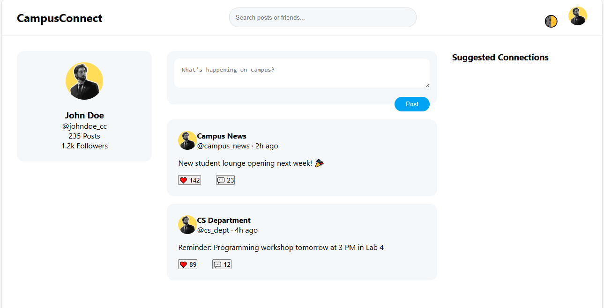

# CampusConnect - College Social Media Platform



A modern social media platform designed specifically for college communities, built with pure HTML, CSS, and JavaScript.

## 🚀 Features

- 🌓 Light/Dark theme toggle
- 📱 Responsive design for all screen sizes
- ✨ Clean, minimalist UI/UX
- 📝 Create and share posts
- ❤️ Like and comment functionality
- 🔍 Search posts and users
- 👥 Suggested connections system
- 📊 User profile statistics
- 🎨 CSS Custom Properties for theme management
- 📦 Pure client-side implementation (no frameworks)

## 🛠️ Technologies Used

- **HTML5** - Semantic markup
- **CSS3** - Modern layout (Grid/Flexbox)
- **JavaScript** - Dynamic functionality
- **CSS Variables** - Theme management
- **Mobile-First** Approach

## 📦 Installation

1. Clone the repository:
```bash
git clone https://github.com/flickShot555/CODOTECH/College-Social-Media-Website.git
```

2. Navigate to project directory:
```bash
cd campusconnect
```

3. Open in your preferred browser:
```bash
open index.html  # macOS
start index.html # Windows
```

## 🎮 Usage
-Toggle between light/dark theme using the moon/sun icon in the navigation bar

-Create new posts using the textarea in the main feed

-Like posts by clicking the heart icon

-Search for posts/users using the search bar

-View profile statistics and suggested connections in sidebars

## 🏗️ Project Structure
campusconnect/
├── index.html         # Main HTML file
├── style.css          # Stylesheet
├── script.js          # JavaScript functionality
└── avatar-placeholder.png  # Default user avatar

## 🌟 Future Enhancements
User authentication system

-Real-time database integration

-Image upload capability

-Direct messaging feature

-Notifications system

-Hashtag support

-Infinite scroll for posts

## 🤝 Contributing
Contributions are welcome! Please follow these steps:

-Fork the project

-Create your feature branch (git checkout -b feature/AmazingFeature)

-Commit your changes (git commit -m 'Add some AmazingFeature')

-Push to the branch (git push origin feature/AmazingFeature)

-Open a Pull Request

## 📧 Contact
Abbas Khan
Linkedin: https://www.linkedin.com/in/the-abbas-khan/
Website: https://www.aepostrophee.kesug.com
Project Link: https://github.com/flickShot555/CODOTECH/College-Social-Media-Website

