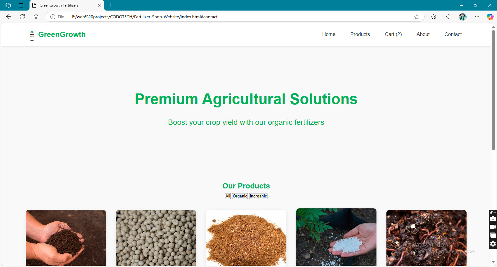

# GreenGrowth Fertilizers -E-Commerce Website



A modern, fully functional e-commerce website for a fertilizer shop, built with HTML, CSS, and JavaScript. This project showcases a clean and organized layout with complete frontend-backend integration using localStorage.

## 🚀 Features

- **Product Management**: Browse and filter fertilizers by category (organic/inorganic).
- **Shopping Cart**: Add/remove products, manage quantities, and calculate totals.
- **Contact Form**: Submit inquiries with localStorage persistence.
- **Responsive Design**: Works seamlessly on all devices.
- **LocalStorage Integration**: Persistent data storage for cart and contact submissions.
- **Interactive UI**: Smooth animations and transitions.

## 🛠️ Technologies Used

- **HTML5**: Semantic structure and accessibility.
- **CSS3**: Modern layout (Grid/Flexbox) and animations.
- **JavaScript**: Core functionality and interactivity.
- **LocalStorage**: Data persistence without a backend.
- **Font Awesome**: Icon system for better UX.

## 📦 Installation

1. Clone the repository:
    ```bash
    git clone https://github.com/flickShot555/main/tree/Fertilizer-Shop-Website.git
    ```
2. Navigate to the project directory:
    ```bash
    cd Fertilizer-Shop-Website
    ```
3. Open in your browser:
    ```bash
    open index.html  # macOS
    start index.html # Windows
    ```

## 🎮 Usage
- Browse products and add them to your cart.

- Manage your cart (update quantities, remove items).

- Submit inquiries through the contact form.

- View real-time updates for cart totals and product availability.

## 🏗️ Project Structure

greengrowth-fertilizers/

├── index.html         # Main HTML file

├── style.css          # Stylesheet

├── script.js          # JavaScript functionality

├── images/            # Product images

└── README.md          # Project documentation

## 🌟 Future Enhancements
- Add user authentication.

- Implement payment gateway integration.

- Add product reviews and ratings.

- Include an admin dashboard for product management.

## 🤝 Contributing

Contributions are welcome! Please follow these steps:

1. Fork the project.

2. Create your feature branch:
    ```bash
    git checkout -b feature/AmazingFeature
    ```

3. Commit your changes:
    ```bash
    git commit -m "Add AmazingFeature"
    ```

4. Push your changes:
    ```bash
    git push origin feature/AmazingFeature
    ```

5. Open a pull request:
    ```bash
    git pull origin main
    git checkout main
    git merge feature/AmazingFeature
    ```

## 📧 Contact

Abbas Khan

Email: abbas1795khan@gmail.com

LinkedIn: https://www.linkedin.com/in/the-abbas-khan

GitHub: https://github.com/flickShot555/

Website: https://www.aepostrophee.kesug.com
