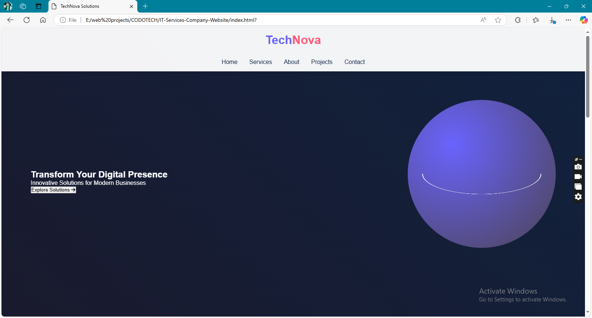

# TechNova Solutions - IT Services Website



A modern, vibrant website for IT services companies featuring 3D animations and interactive elements, built with pure HTML, CSS, and JavaScript.

## 🚀 Features

- 🌐 Interactive 3D globe animation
- 🎮 Mouse-driven 3D card rotations
- ⚡ Smooth page transitions
- 📱 Fully responsive design
- 🌈 Gradient color schemes
- 🛡️ CSS 3D transforms
- 📜 Intersection Observer animations
- 💡 Dynamic loading screen
- 📧 Contact form validation
- 🖱️ Parallax hover effects

## 🛠️ Technologies Used

- **HTML5** - Semantic structure
- **CSS3** - Animations & 3D transforms
- **JavaScript** - Interactive functionality
- **CSS Variables** - Theme management
- **Intersection Observer API** - Scroll animations
- **Font Awesome** - Icon system

## 📦 Installation

1. Clone the repository:
```bash
git clone https://github.com/flickShot555/CODOTECH/IT-Services-Company-Website.git
```

2. Navigate to project directory:
```bash
cd technova-solutions
```

3. Open in your preferred browser:
```bash
open index.html  # macOS
start index.html # Windows
```

## 🎮 Usage

-Move mouse around the 3D globe for interactive rotation

-Click navigation links for smooth scrolling

-Hover over service cards for 3D flip effects

-Submit contact form with validation

-Watch elements animate on scroll

-Experience loading screen on initial visit

## 🏗️ Project Structure

technova-solutions/

├── index.html         # Main HTML file

├── style.css          # Stylesheet with animations

├── script.js          # Interactive functionality

└── assets/            # Recommended image directory

    ├── projects/      # Project screenshots

    └── icons/         # Custom icons

## 🌟 Future Enhancements

-Dark/Light theme toggle

-Client testimonial slider

-Pricing calculator component

-Live chat integration

-Team member profiles

-Case study modals

-Service package comparisons

## 🤝 Contributing

Contributions are welcome! Please follow these steps:

1. Fork the project

2. Create your feature branch:
```bash
git checkout -b feature/AmazingFeature
```

3. Commit your changes:
```bash
git commit -m 'Add AmazingFeature'
```

4. Push your changes:
```bash
git push origin feature/AmazingFeature
```

5. Open a pull request

## 📧 Contact

Abbas Khan

email: abbas1795khan@gmail.com

LinkedIn: https://www.linkedin.com/in/the-abbas-khan/

Website: https://www.aepostrophee.kesug.com

Project Link: https://github.com/flickShot555/CODOTECH/IT-Services-Company-Website