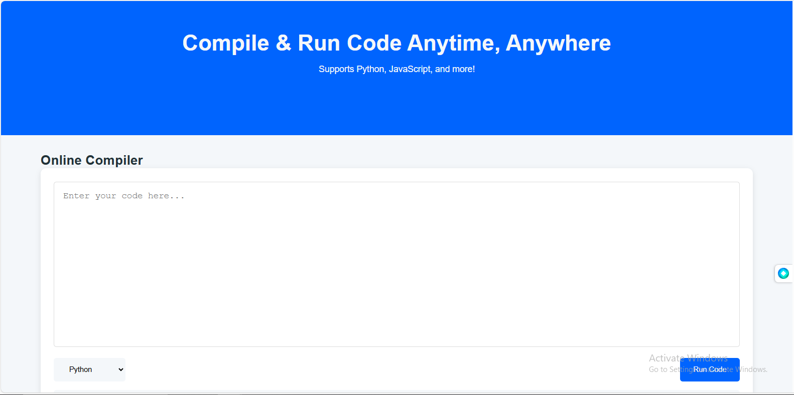

# Aepostrophee - Online Compiler



A modern online compiler website that supports Python and JavaScript, built with HTML, CSS, and JavaScript. This project uses the Piston API for code execution and provides a seamless coding experience.

## 🚀 Features

- **Multi-Language Support**: Compile and run Python and JavaScript code.
- **Real-Time Output**: Get instant feedback on your code execution.
- **Clean UI**: Minimalist and user-friendly interface.
- **Responsive Design**: Works on all devices.
- **API Integration**: Powered by Piston API for code execution.
- **Error handling**: Displays clear error messages for failed executions


## 🛠️ Technologies Used

- **HTML5**: Semantic structure.
- **CSS3**: Modern layout and styling.
- **JavaScript**: Core functionality and API integration.
- **Piston API**: Code execution backend.

## 📦 Installation

1. Clone the repository:
   ```bash
   git clone https://github.com/flickShot555/Online-Compiler-Website.git
   ```

2. Navigate to the project directory:
    ```bash
    cd Online-Compiler-Website
    ```

3. Open in your browser:
    ```bash
    open index.html  # macOS
    start index.html # Windows
    ```
Note:
- You need to have an active internet connection to run the code execution API.
- The code execution API may have a rate limit, so you may encounter delays in execution.
- This project is for educational purposes only and should not be used for commercial purposes without proper licensing.
- You might face CORS issues while running the code execution API. You can use a proxy server to bypass this issue, or you can install Python and use python local server for better experience.

## 🎮 Usage
Select a programming language (Python or JavaScript).

Write your code in the editor.

Click "Run Code" to see the output.


## 🏗️ Project Structure

Online-Compiler-Website/

├── index.html         # Main HTML file

├── style.css          # Stylesheet

├── script.js          # JavaScript functionality

└── README.md          # Project documentation


## 🌟 Future Enhancements

- Add more programming languages (e.g., Java, C++).
- Implement code saving and sharing.
- Add user authentication.
- Include a code formatter.
- Improve UI/UX with themes (light/dark mode).
- Add syntax highlighting for the code editor.


## 🤝 Contributing

Contributions are welcome! Please follow these steps:
1. Fork the repository.
2. Create your feature branch:
    ```bash
    git checkout -b feature/AmazingFeature
    ```

3. Commit your changes:
    ```bash
    git commit -m 'Add some AmazingFeature'
    ```

4. Push to the branch:
    ```bash
    git push origin feature/AmazingFeature
    ```

5. Open a pull request:
    ```bash
    git pull-request
    ```

## 📝 License

This project is licensed under the MIT License.

## 🧑‍💻 Author

### Abbas Khan

Email: abbas1795khan@gmail.com

LinkedIn: https://www.linkedin.com/in/the-abbas-khan

GitHub: https://github.com/flickShot555

Website: https://www.aepostrophee.kesug.com